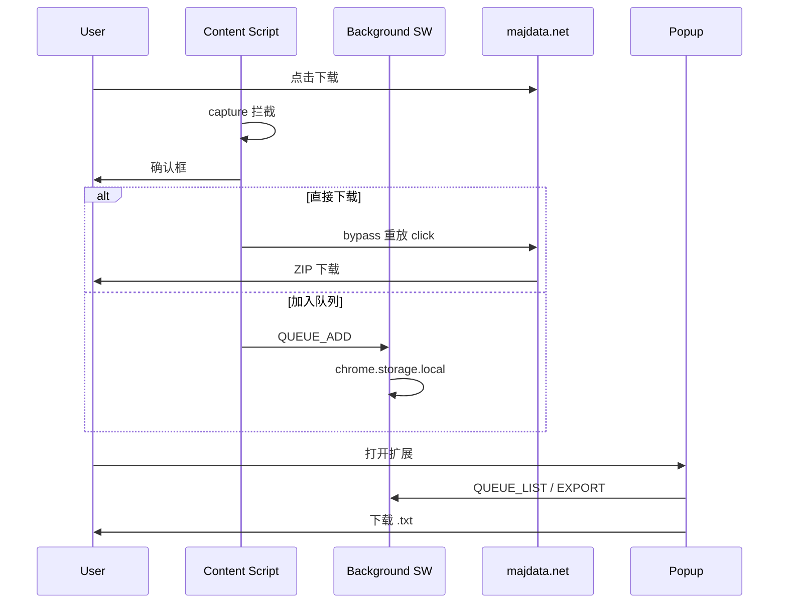

# majdata-download-extension 本地知识库（SSOT）

## 1. 项目定位

| 项 | 说明 |
|----|------|
| 摘要 | 面向 majdata.net 的浏览器扩展：拦截谱面下载按钮，支持「直接下载 / 加入队列」，Popup 管理并导出 TXT |
| 阶段 | 1 ✅ v0.1 · 1.5 设置/导入/JSON v0.2 · 2 批量ZIP v0.3 · 3 CLI 可选 |
| 包管理 | pnpm + WXT（拟定） |
| 目标浏览器 | Chrome / Edge（MV3）；Firefox 可选 |

**核心约束：** 直接下载必须走站点原 `downloadSong` 逻辑（bypass 重放点击），扩展不重写 ZIP 打包。

---

## 2. 目录与职责

```
majdata-download-extension/
├── README.md
├── AGENTS.md
├── docs/                    # 规划文档（01~06）
├── .cursor/
│   ├── KNOWLEDGE_BASE.md    # 本文件
│   └── rules/               # Cursor SSOT 规则
└── src/                     # （待实现）见 docs/03-architecture.md
    ├── background/          # Service Worker：队列、导出
    ├── content/             # 拦截、解析、确认框
    ├── popup/               # 列表 UI
    └── shared/              # 类型、URL 构建、清洗
```

---

## 3. 核心数据流



**队列主键：** `songId`

**资源 URL 模板：**

```
/api3/api/maichart/{id}/track
/api3/api/maichart/{id}/chart
/api3/api/maichart/{id}/image?fullImage=true
/api3/api/maichart/{id}/video
```

---

## 4. 外部协作

| 外部系统 | 说明 |
|----------|------|
| MajdataNet 前端 | 下载入口：`SongCard.tsx`、`SongPage.tsx` → `downloadSong()` |
| 阶段 2 CLI | 消费 `docs/06-export-format.md` 定义的 `MAJDATA-QUEUE v1` |

扩展**不**修改 MajdataNet 仓库；选择器失效时仅更新本仓库 content script。

---

## 5. 构建、测试、发布

```bash
pnpm install
pnpm dev      # WXT 开发
pnpm build    # 产出 dist/ 或 dist/chrome-mv3/
pnpm lint
pnpm test     # parseSongContext、export 单测
```

发布：阶段 1 以「加载已解压扩展程序」分发；Chrome Web Store 为 P1。

---

## 6. Agent 修改约束

- 实现前必读 `docs/01-site-analysis.md` 与 `docs/03-architecture.md`
- 不修改 majdata.net 站点代码
- 导出格式变更须 bump `MAJDATA-QUEUE` 版本并更新 `docs/06-export-format.md`
- 拦截逻辑变更须更新 `docs/04-phase1-tasks.md` 验收项
- 阶段 2 功能放在独立 CLI/服务，不塞进阶段 1 PR

---

## 7. 文档维护

结构变更后运行 `maintain-project-agent-docs` Refresh 流程。

**最后人工校对主题：** MajdataNet 下载 API 路径、SongCard/SongPage 选择器、导出格式 v1、WXT 构建命令。
