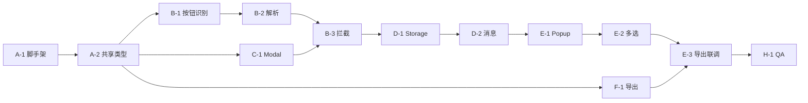

# 阶段 1 子任务拆分

> 每个任务含：**目标 · 输入 · 产出 · 验收 · 依赖 · 预估**

---

## Epic A — 项目脚手架

### A-1 初始化工程

| 项 | 内容 |
|----|------|
| 目标 | 可加载的空扩展 |
| 产出 | WXT/CRXJS 项目、`manifest.json`、`pnpm dev` 可构建 |
| 验收 | Chrome「加载已解压的扩展程序」无报错 |
| 预估 | 2h |
| 依赖 | 无 |

**检查清单：**

- [ ] TypeScript strict
- [ ] ESLint
- [ ] path alias `@/` → `src/`

### A-2 共享类型与工具

| 项 | 内容 |
|----|------|
| 目标 | 统一 `QueueItem`、`SongContext`、消息类型 |
| 产出 | `src/shared/types.ts`, `urls.ts`, `sanitize.ts` |
| 验收 | 单元测试 `buildAssetUrls('abc')` 四条 URL 正确 |
| 预估 | 2h |
| 依赖 | A-1 |

---

## Epic B — Content Script 拦截

### B-1 下载按钮识别

| 项 | 内容 |
|----|------|
| 目标 | 可靠识别列表/详情下载按钮 |
| 产出 | `findDownloadButton()`, `isMajdataDownloadClick()` |
| 验收 | 手动：首页 ≥5 张卡片、详情页 ≥3 首，识别率 100% |
| 预估 | 4h |
| 依赖 | A-2 |

**实现提示：**

- 详情页：`location.pathname.endsWith('/song')`
- 列表页：从 `public/download.svg` 提取 path `d` 属性做 SVG 匹配（更稳 than class）

### B-2 谱面上下文解析

| 项 | 内容 |
|----|------|
| 目标 | 从 DOM/URL 得到 songId + title + assets |
| 产出 | `parseSongContext.ts` |
| 验收 | fixture HTML 单测 ≥6 case（详情/列表/缺 artist/富文本标题） |
| 预估 | 4h |
| 依赖 | B-1 |

### B-3 Capture 拦截 + Bypass

| 项 | 内容 |
|----|------|
| 目标 | 拦截下载点击；直接下载重放原 handler |
| 产出 | `intercept.ts` |
| 验收 | AC-1 AC-2：装/不装扩展对比 ZIP 下载一致 |
| 预估 | 4h |
| 依赖 | B-1, B-2 |

---

## Epic C — 确认框与反馈

### C-1 页内 Modal

| 项 | 内容 |
|----|------|
| 目标 | Shadow DOM 模态框，三按钮 |
| 产出 | `confirmDialog.ts` + 基础样式 |
| 验收 | 不污染页面 CSS；Esc/取消有效 |
| 预估 | 3h |
| 依赖 | A-2 |

### C-2 Toast 提示

| 项 | 内容 |
|----|------|
| 目标 | 入队成功/失败轻提示 |
| 产出 | `toast.ts` |
| 验收 | 3s 自动消失，不阻挡操作 |
| 预估 | 1h |
| 依赖 | C-1 |

---

## Epic D — Background 队列

### D-1 Storage CRUD

| 项 | 内容 |
|----|------|
| 目标 | 队列增删改查 + songId 去重 |
| 产出 | `background/queue.ts` |
| 验收 | AC-3 AC-4；重启浏览器数据仍在 |
| 预估 | 3h |
| 依赖 | A-2 |

### D-2 消息路由

| 项 | 内容 |
|----|------|
| 目标 | 处理 `QUEUE_*` 消息 |
| 产出 | `background/index.ts` |
| 验收 | DevTools service worker 无 unhandled rejection |
| 预估 | 2h |
| 依赖 | D-1 |

### D-3 Badge 计数（P2）

| 项 | 内容 |
|----|------|
| 目标 | 工具栏图标显示队列数量 |
| 验收 | 入队 +1，清空归零 |
| 预估 | 1h |
| 依赖 | D-1 |

---

## Epic E — Popup 界面

### E-1 列表展示

| 项 | 内容 |
|----|------|
| 目标 | 展示队列，空状态 |
| 产出 | `popup/App.tsx` |
| 验收 | 10+ 条目滚动正常；点击标题打开谱面页 |
| 预估 | 4h |
| 依赖 | D-2 |

### E-2 多选与批量操作

| 项 | 内容 |
|----|------|
| 目标 | 全选、单选、删除选中/全部 |
| 验收 | 删除后 storage 同步；Popup 即时刷新 |
| 预估 | 3h |
| 依赖 | E-1 |

### E-3 导出入口

| 项 | 内容 |
|----|------|
| 目标 | 导出选中/全部 TXT |
| 产出 | 调用 `QUEUE_EXPORT` + 触发下载 |
| 验收 | AC-5 |
| 预估 | 2h |
| 依赖 | E-2, F-1 |

---

## Epic F — 导出模块

### F-1 TXT 生成器

| 项 | 内容 |
|----|------|
| 目标 | 按 [06-export-format.md](./06-export-format.md) 输出 |
| 产出 | `background/export.ts` |
| 验收 | 单测：2 条目导出字符串 snapshot |
| 预估 | 2h |
| 依赖 | A-2 |

---

## Epic G — 设置与打磨（P1）

### G-1 Options 页

| 项 | 内容 |
|----|------|
| 目标 | 开关拦截、默认动作、队列上限 |
| 预估 | 3h |

### G-2 国际化

| 项 | 内容 |
|----|------|
| 目标 | 扩展 UI 中英文（`_locales`） |
| 预估 | 2h |

---

## Epic H —  QA 与发布

### H-1 手动测试矩阵

| 浏览器 | 场景 |
|--------|------|
| Chrome 最新 | 全流程 |
| Edge 最新 | 全流程 |
| Firefox | 评估 MV3 兼容（可选） |

### H-2 文档与版本

| 项 | 内容 |
|----|------|
| 产出 | CHANGELOG v0.1.0、README 安装说明 |
| 预估 | 1h |

---

## 推荐实施顺序（关键路径）

## 工时汇总

| Epic | 预估 |
|------|------|
| A 脚手架 | 4h |
| B 拦截 | 12h |
| C UI 反馈 | 4h |
| D Background | 6h |
| E Popup | 9h |
| F 导出 | 2h |
| H QA | 4h |
| **P0 合计** | **~41h（约 5 人日）** |
| G P1 | +5h |

## Definition of Done（阶段 1 完成定义）

1. 所有 P0 任务验收通过
2. README 含安装步骤与已知限制
3. 至少 1 次对 MajdataNet `main` 分支对应线上行为的手动回归
4. 导出文件可被简单脚本解析（见 `06-export-format.md` 参考解析器）
