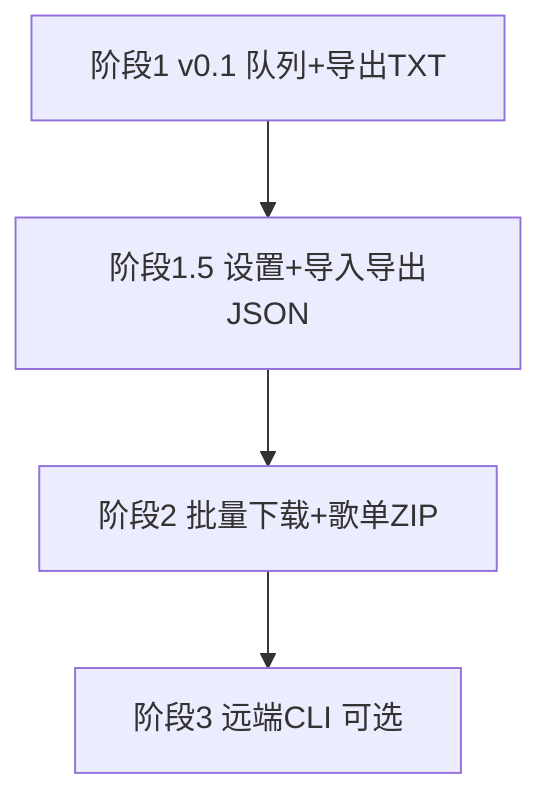

# 项目路线图

> 最后更新：2026-06-04（v0.1 已发布）

## 阶段总览

| 阶段 | 版本 | 主题 | 状态 |
|------|------|------|------|
| **1** | v0.1 | 下载拦截 · 队列 · Popup · 导出 TXT | ✅ 已完成 |
| **1.5** | v0.2 | 设置页 · 导出 TXT/JSON · 导入 TXT/JSON | 📋 已规划 |
| **2** | v0.3 | 批量下载谱面 · 歌单 ZIP | 📋 已规划 |
| **3** | v0.4+ | 远端 CLI / Agent（可选） | 💡 展望 |

## 依赖关系

## 文档索引

| 文档 | 内容 |
|------|------|
| [02-prd.md](./02-prd.md) | 阶段 1 PRD（已完成） |
| [07-phase1.5-prd.md](./07-phase1.5-prd.md) | 阶段 1.5：设置 / 导入 / JSON 导出 |
| [08-phase2-prd-batch-download.md](./08-phase2-prd-batch-download.md) | 阶段 2：批量下载与压缩包 |
| [05-phase2-outlook.md](./05-phase2-outlook.md) | 阶段 3：远端 CLI 展望 |
| [06-export-format.md](./06-export-format.md) | 队列交换格式（TXT + JSON） |
| [04-phase1-tasks.md](./04-phase1-tasks.md) | 全阶段子任务清单 |

## 推荐实施顺序（下一步）

1. **Epic I** — Options 设置页 + `exportFormat` 存储
2. **Epic J** — JSON 导出 + 统一 import 解析器
3. **Epic K** — Popup 导入入口 + round-trip 测试
4. **Epic L** — 单曲 fetch 与目录结构（对齐 `Break Through Myself/`）
5. **Epic M** — 批量 job + 歌单 ZIP
6. **Epic N** — 进度 UI + `downloads` 权限

详细任务见 [04-phase1-tasks.md](./04-phase1-tasks.md) §阶段 1.5 / 阶段 2。
